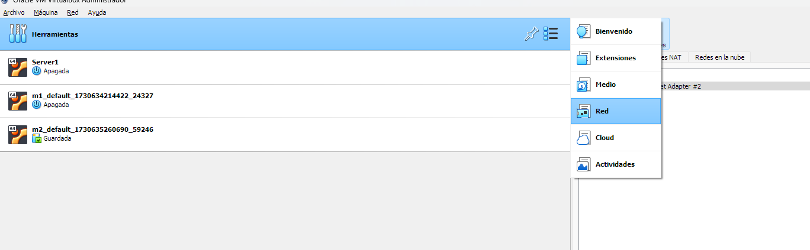
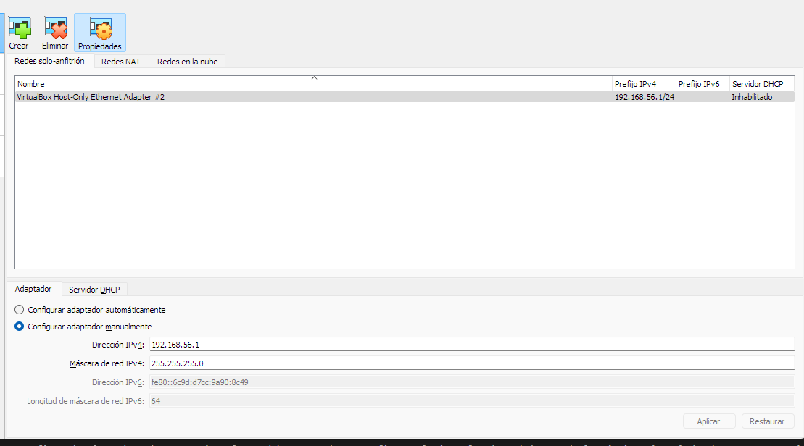
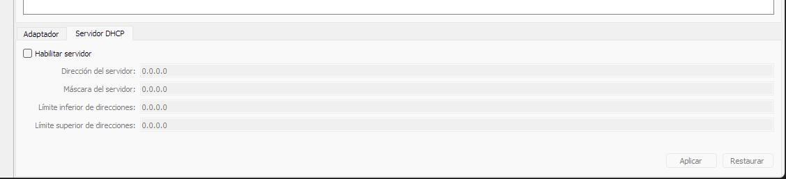
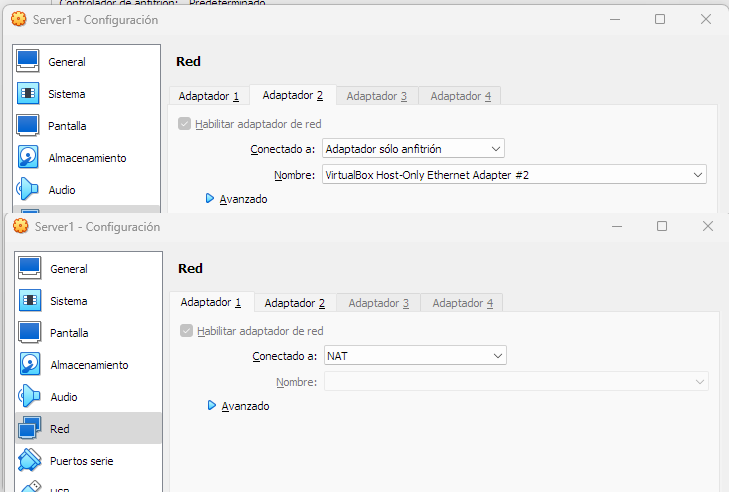

## Configurar IP estática en Ubuntu Server con VirtualBox

El problema que téniamos cuando asginábamos la IP con el modo bridge, es que dependemos de la red donde nos queramos conectar. Hay muchas veces, que no necesitamos ese nivel, sino que es suficiente tener una IP estática asignada a nuestra maquina virtual pero la conexión es únicamente a través del host. 

Esto será suficiente en la mayoría de los casos para tener máquinas con IP a las que podamos acceder. 

En este capítulo veremos como se hace eso:

### Configurar los adaptadores de red en VirtualBox

1. **Adaptador NAT:**
   - Permite que la máquina virtual tenga acceso a Internet a través del host.
   - No requiere configuración específica.

2. **Adaptador solo anfitrión:**
   - Crea una red interna entre la máquina virtual y el host.
   - Para asignar una IP estática:
     1. En la configuración de red de la máquina virtual, selecciona el adaptador "solo anfitrión".
     2. Elige la opción "Dirección IP estática" y asigna una IP dentro del rango 192.168.56.0/24.
     3. Establece la máscara de subred como 255.255.255.0.

### Configurar la interfaz de red en Ubuntu Server

1. Lo primero es crear el adaptador de red, para ello vamos a:


2. Nos creamos un adaptador de **solo anfitrión**.



Aquí deberemos de fijarnos en que tenemos una dirección de **máscara de red** y la **dirección de red**, que será la base para luego asignar la IP dentro de nuestra máquina.

3. Desactivamos el DHCP



Una vez configurados los adaptadores en VirtualBox, debes proceder a configurar la interfaz de red dentro de la máquina virtual de Ubuntu Server. Sigue estos pasos:

1. Conéctate a la máquina virtual de Ubuntu Server.

2. Edita el archivo de configuración de red de netplan:
   ```
   sudo nano /etc/netplan/00-installer-config.yaml
   ```

3. Agrega la siguiente configuración, reemplazando los valores de IP y puerta de enlace según tu entorno: **Recordad la dirección de red que hemos puesto en el adaptador Host Only**
   ```yaml
   network:
     version: 2
     renderer: networkd
     ethernets:
       enp0s3:
         dhcp4: yes
       enp0s8:
         addresses: 
         - 192.168.56.10/24
         nameservers:
           addresses: [8.8.8.8, 8.8.4.4]
   ```

4. Aplica los cambios:
   ```
   sudo netplan apply
   ```

5. Verifica que la configuración se haya aplicado correctamente:
   ```
   ip addr show enp0s8
   ```


### A tener en cuenta:

En la configuración que hemos puesto tenemos la primera enp0s3 (conigurada como NAT) y la segunda enp0s8( Configurada como Host only).

Esto es así porque yo, en mi configuración tengo los adaptadores en ese orden. Si lo cambiamos, eso hay que cambiarlo también en el fichero yaml.


