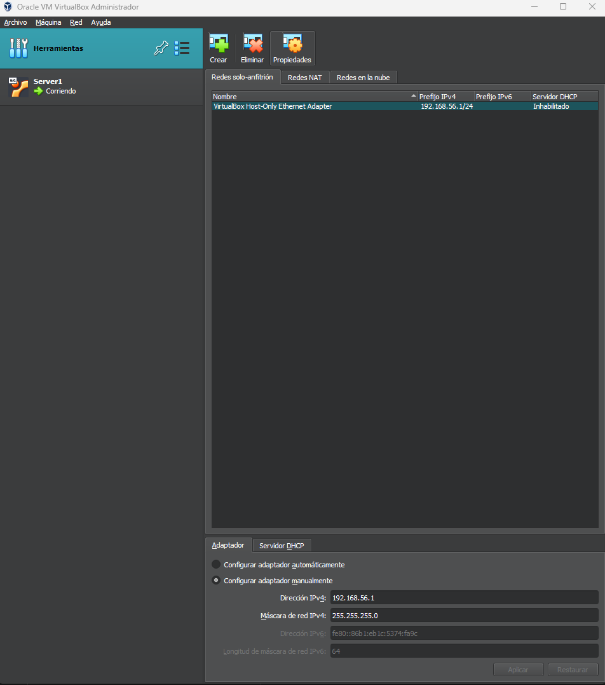

### Opciones de Red en VirtualBox

Cuando vas a la configuración de redes en VirtualBox, puedes crear y gestionar diferentes tipos de redes, cada una con características únicas. Estas opciones permiten definir cómo se conectan tus VMs entre sí y con el anfitrión o la red externa.

#### 1. **Redes de Solo Anfitrión (Host-Only Networks)**

**Descripción:**
- Esta opción crea una red privada exclusiva entre la máquina anfitriona y las VMs. Las VMs en una red de solo anfitrión pueden comunicarse entre sí y con el anfitrión, pero no tienen acceso a Internet ni a otras redes externas.
- VirtualBox crea un adaptador virtual de red en el anfitrión que permite la comunicación con las VMs en esta red de solo anfitrión.

**Casos de Uso:**
- **Desarrollo y pruebas locales**: Útil para desarrollar y probar aplicaciones en un entorno controlado y aislado.
- **Entornos seguros y aislados**: Ideal para simular una red segura donde no se desea exposición a Internet o a redes externas.
- **Pruebas de red local**: Si necesitas verificar el funcionamiento de servicios como servidores de archivos, DNS o DHCP en una red privada, las redes de solo anfitrión son una buena opción.

**Ejemplo:** 
Supongamos que quieres probar un servidor web en una VM y acceder a él solo desde tu máquina anfitriona. Con una red de solo anfitrión, podrías acceder a este servidor mediante la IP que la VM tenga en esta red, sin preocuparte por que esté accesible desde otras redes.

---

#### 2. **Redes NAT (Network Address Translation Networks)**

**Descripción:**
- Una red NAT en VirtualBox permite que las VMs se conecten a Internet a través de la conexión de red del anfitrión, como si estuvieran detrás de un router.
- Las VMs en la misma red NAT pueden comunicarse entre sí sin interferir con otras redes.
- Las VMs en esta red no son accesibles desde la red externa sin configuraciones adicionales, como el reenvío de puertos.

**Casos de Uso:**
- **Acceso a Internet sin configuración avanzada**: Ideal para acceder a Internet desde VMs sin exponerlas a la red externa.
- **Simulación de redes privadas**: Puedes crear varias VMs que se comuniquen entre sí y con Internet, pero sin ser accesibles desde fuera.

**Ejemplo:** 
Tienes una VM que necesita actualizar paquetes y descargar archivos de Internet, pero no quieres que sea accesible desde fuera. Con una red NAT, la VM podrá acceder a Internet a través de la conexión del anfitrión.

---

#### 3. **Redes en la Nube (Cloud Networks)**

**Descripción:**
- Las redes en la nube permiten conectar VMs locales en VirtualBox con servicios en la nube. VirtualBox tiene integración con algunos proveedores de nube (como Oracle Cloud), permitiendo que las VMs locales actúen como si fueran parte de una infraestructura en la nube.
- Puedes configurar esta opción para conectar VMs en VirtualBox con recursos de la nube sin necesidad de hardware adicional.

**Casos de Uso:**
- **Despliegue híbrido**: Si tienes una infraestructura en la nube y quieres probar cómo funcionarían ciertos servicios al interactuar con tus VMs locales, una red en la nube puede simular este entorno.
- **Pruebas de integración en la nube**: Puedes probar cómo se comportan las aplicaciones al interactuar con bases de datos, almacenamiento o aplicaciones en la nube sin necesidad de desplegarlas primero en el proveedor de la nube.

**Ejemplo:** 
Si trabajas en un entorno donde partes de tu aplicación están en la nube y quieres simular su interacción con VMs locales, las redes en la nube te permiten emular esta configuración.

---

#### 4. **Adaptador DHCP**

**Descripción:**
- El adaptador DHCP es un servicio que VirtualBox puede habilitar para asignar automáticamente direcciones IP a las VMs en una red específica, como una red de solo anfitrión o una red NAT.
- Con DHCP habilitado, las VMs obtienen una dirección IP automáticamente dentro del rango definido, eliminando la necesidad de configurarlas manualmente.

**Casos de Uso:**
- **Asignación automática de IPs**: Útil cuando tienes varias VMs y quieres que cada una obtenga automáticamente una IP sin configurarlas individualmente.
- **Simulación de entornos reales**: Al habilitar DHCP, puedes simular una red como en una empresa, donde cada dispositivo obtiene su IP automáticamente desde un servidor DHCP.

**Ejemplo:** 
Si tienes tres VMs en una red de solo anfitrión para pruebas internas, puedes activar el adaptador DHCP en VirtualBox. Así, cada VM obtendrá automáticamente una IP de esa red sin configurarlas manualmente.

---

### Ejemplos Prácticos y Combinaciones de Uso

1. **Red Local para Pruebas Internas con Host-Only + DHCP**
   - Imagina que quieres configurar tres VMs para simular un entorno de red local en una empresa, sin acceso a Internet.
   - Configura una **red de solo anfitrión** y habilita **DHCP** en esa red. Cada VM recibirá automáticamente una IP y podrá comunicarse con las demás y con el anfitrión, sin tener acceso a redes externas.

2. **Entorno Aislado con Acceso a Internet con NAT + Reenvío de Puertos**
   - Si tienes una VM con un servidor web y necesitas acceso a Internet para actualizaciones, pero también quieres que sea accesible desde fuera, usa **NAT** y configura reglas de **reenvío de puertos**.
   - La VM tendrá acceso a Internet a través de la red NAT y podrás acceder a servicios específicos en la VM, como el servidor web, reenviando un puerto del anfitrión al puerto correspondiente en la VM.

3. **Integración Híbrida con la Nube con Cloud Network**
   - Si estás probando una infraestructura híbrida, donde parte de la aplicación está en la nube y otra parte en servidores locales, configura una **red en la nube** en VirtualBox.
   - Esto te permite conectar tus VMs locales en VirtualBox con los recursos en la nube (si tu proveedor de nube es compatible), lo que facilita pruebas de integración.

4. **Simulación Completa de Red Empresarial con Bridge + DHCP**
   - Para una simulación más avanzada donde cada VM debe comportarse como un dispositivo real en la red local, usa el adaptador **en puente** y habilita **DHCP** en la red local o asigna IPs manualmente.
   - Cada VM se conectará a la red local con su propia IP y será accesible desde otros dispositivos en la red.

---

### Resumen de las Opciones y sus Usos Comunes

- **Redes de Solo Anfitrión**: Red privada entre el anfitrión y las VMs. Ideal para entornos aislados sin acceso a Internet.
- **Redes NAT**: Permite que las VMs accedan a Internet sin ser accesibles desde fuera. Útil para desarrollo y pruebas con acceso limitado.
- **Redes en la Nube**: Conecta las VMs locales con recursos en la nube, ideal para pruebas híbridas.
- **Adaptador DHCP**: Asigna IPs automáticamente en una red configurada, eliminando la necesidad de configuraciones manuales.
Tienes razón; voy a explicarlo en más profundidad para que entiendas el propósito y las implicaciones de configurar estas redes y tarjetas en VirtualBox.

---

### ¿Qué es lo que ve la máquina virtual cuando configuras una red en VirtualBox?

Cuando configuras una red en VirtualBox, lo que haces es "conectar" la máquina virtual a una tarjeta de red virtual. Estas tarjetas virtuales actúan como interfaces de red en la VM y funcionan de forma similar a las tarjetas de red físicas en un equipo real. 

La máquina virtual "ve" estas tarjetas como dispositivos de red, de modo que puedes configurarlas desde el sistema operativo de la VM, igual que lo harías en un equipo físico.

---

### ¿Cuántas tarjetas de red puede tener una máquina virtual en VirtualBox?

En VirtualBox, puedes añadir hasta **4 adaptadores de red** por defecto (aunque puedes llegar hasta 8 mediante configuraciones avanzadas en la línea de comandos). Cada adaptador de red puede configurarse de forma independiente con un tipo de red diferente (NAT, puente, solo anfitrión, etc.).

---

### ¿Sirve de algo tener varias tarjetas de red en una máquina virtual?

Sí, tener varias tarjetas de red puede ser útil en muchos escenarios, especialmente si quieres que tu máquina virtual esté conectada a diferentes redes o que tenga múltiples rutas de conexión. Aquí tienes algunos ejemplos y casos de uso:

---

### Ejemplos de Escenarios con Múltiples Tarjetas de Red

#### Ejemplo 1: Separar el Acceso a Internet y el Acceso a la Red Local
- **Configuración**: Configura un adaptador en modo **NAT** para que la VM tenga acceso a Internet y otro adaptador en modo **Host-Only** para conectarse solo con el anfitrión.
- **Propósito**: Esto permite que la máquina virtual acceda a Internet sin exponerse directamente a la red local, mientras que el adaptador de solo anfitrión le permite comunicarse con el sistema anfitrión para compartir archivos, pruebas de aplicaciones, etc.
- **Lo que ve la VM**: En este caso, la VM ve dos tarjetas de red; una que se conecta a Internet a través del NAT y otra para comunicarse exclusivamente con el anfitrión.

#### Ejemplo 2: Red Local con Acceso a Internet y Red Privada para Pruebas
- **Configuración**: Un adaptador configurado en modo **Puente** para obtener una IP en la red local (visible desde otros dispositivos de la red) y otro adaptador en modo **Internal Network** para pruebas entre varias VMs sin interferencia externa.
- **Propósito**: Esta configuración permite que la VM sea accesible desde cualquier dispositivo de la red local (por ejemplo, para un servidor de pruebas) mientras mantiene una red privada aislada con otras VMs, ideal para pruebas de aplicaciones o simulación de redes internas.
- **Lo que ve la VM**: La VM vería dos tarjetas de red. Una de ellas le da acceso a la red local e Internet (a través del adaptador en puente), mientras que la otra solo le permite comunicarse con otras VMs en la red interna.

#### Ejemplo 3: Simulación de Red en la Nube con Conexión Local y Nube
- **Configuración**: Configura un adaptador en **Cloud Network** para que la VM se conecte a recursos en la nube y otro en modo **NAT** para tener acceso a Internet desde el anfitrión.
- **Propósito**: Esto permite simular una infraestructura híbrida, donde la VM puede conectarse a servicios en la nube (como bases de datos o aplicaciones) y al mismo tiempo tener acceso a Internet para descargar paquetes o realizar actualizaciones.
- **Lo que ve la VM**: Dos tarjetas de red; una que le permite acceder a la infraestructura en la nube y otra para acceso a Internet.

---

### ¿Cuándo es útil tener varias tarjetas de red?

Las múltiples tarjetas de red son especialmente útiles en los siguientes casos:

1. **Simulación de Entornos de Red Complejos**: Puedes tener un adaptador conectado a la red local, otro a una red interna de VirtualBox, y otro con acceso exclusivo al anfitrión. Esto es útil para simular servidores y dispositivos que necesitan conectarse a múltiples redes de forma simultánea.

2. **Aislamiento de Redes**: Si necesitas que una VM esté conectada a Internet para descargar actualizaciones, pero también necesitas una red aislada entre varias VMs (por ejemplo, para pruebas de seguridad), puedes usar varias tarjetas. Una tarjeta se conecta a Internet y la otra a una red aislada.

3. **Entornos de Pruebas en Desarrollo de Software**: Si estás probando aplicaciones que requieren varias redes (por ejemplo, una aplicación que se comunica con una base de datos en una red privada y con usuarios en una red pública), tener múltiples tarjetas permite que cada servicio esté aislado y simulado en una red específica.

4. **Conectividad con Infraestructuras en la Nube**: Usar el adaptador **Cloud Network** junto con adaptadores de red locales permite que las VMs trabajen con servicios en la nube mientras están conectadas a recursos locales, simulando así una infraestructura híbrida.

---

### Ejemplo Detallado de Configuración con Múltiples Adaptadores de Red

Supongamos que tienes un servidor de pruebas que necesita:
- **Acceso a Internet** para actualizaciones y descargas.
- **Conexión con el anfitrión** para intercambiar archivos o configuraciones.
- **Red aislada** para comunicarse solo con otras VMs de pruebas sin interferencias externas.

**Configuración:**
1. **Adaptador 1 (NAT)**: Configurado para proporcionar acceso a Internet. Este adaptador permite que la VM se conecte a Internet, pero no es accesible directamente desde fuera de la red NAT.
2. **Adaptador 2 (Host-Only)**: Proporciona una red privada con el anfitrión. Permite comunicación directa con la máquina anfitriona, ideal para transferencias de archivos o pruebas locales.
3. **Adaptador 3 (Internal Network)**: Crea una red interna para pruebas aisladas entre varias VMs. Solo las VMs que pertenecen a la misma red interna pueden comunicarse, sin acceso a Internet ni al anfitrión.

**Lo que ve la VM:**
- La VM tendrá tres interfaces de red en su sistema operativo:
   - Una que recibe una IP del adaptador NAT para acceder a Internet.
   - Otra con una IP privada proporcionada por el adaptador Host-Only para comunicarse con el anfitrión.
   - Y una tercera IP en la red interna para comunicarse con otras VMs en la misma red.

**Beneficios:**
- **Aislamiento y seguridad**: El adaptador de red interna garantiza que las pruebas que realices entre VMs no se expongan a Internet ni a la red local.
- **Versatilidad en las pruebas**: Puedes realizar pruebas que involucren Internet, el anfitrión y otras VMs, cada una en un entorno de red específico.
- **Simulación realista**: Esto te permite simular un entorno de trabajo que es muy similar a una red corporativa o de desarrollo, donde los servicios suelen estar distribuidos en varias redes.
