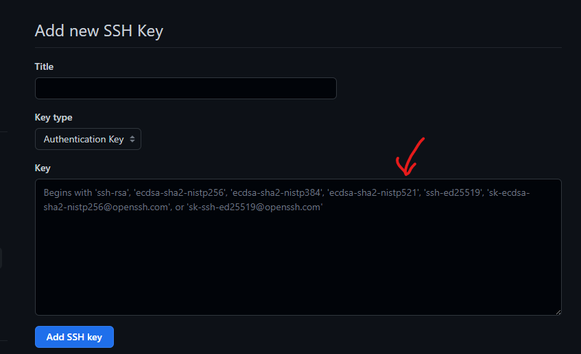

# 01 Introducción.
En este tutorial básico vamos a aprender qué es GIT y como vamos a emplearlo para los flujos de trabajo cotidianos.


Git es un sistema de control de versiones que permite gestionar los cambios en los archivos de un proyecto de forma eficiente y segura. Git se basa en el concepto de repositorio, que es el espacio donde se almacena toda la información del proyecto, incluyendo el historial de cambios, las ramas, las etiquetas y los archivos. Git tiene dos tipos de repositorios: el local y el remoto.

* El **repositorio local** es el que se encuentra en tu máquina, donde puedes trabajar con los archivos sin necesidad de conexión a internet. El repositorio local se divide en tres áreas: el directorio de trabajo, el área de preparación y el directorio de Git.

    * El directorio de trabajo (o workspace) es el espacio donde se encuentran los archivos que se están modificando. Aquí se pueden crear, editar o eliminar archivos según las necesidades del proyecto. Los archivos del directorio de trabajo pueden estar en uno de estos tres estados: modificados, sin seguimiento o ignorados. Los archivos modificados son aquellos que han sufrido algún cambio desde la última confirmación (commit). Los archivos sin seguimiento son aquellos que no están bajo el control de Git, es decir, que no se han añadido al repositorio. Los archivos ignorados son aquellos que le indicamos a Git que no queremos que gestione, por ejemplo, los archivos temporales o los archivos de configuración. Para indicarle a Git qué archivos ignorar, podemos usar un archivo llamado .gitignore, donde escribimos los nombres o patrones de los archivos que no queremos que Git tenga en cuenta.

  * El área de preparación (o staging area) es el espacio donde se seleccionan los archivos que se van a incluir en la próxima confirmación (commit). Aquí se pueden añadir o quitar archivos del directorio de trabajo usando los comandos git add y git rm. Los archivos del área de preparación están en estado preparado, lo que significa que están listos para ser confirmados. El área de preparación nos permite organizar los cambios en grupos lógicos antes de guardarlos en el repositorio.

  *   El directorio de Git (o repository) es el espacio donde se guardan las instantáneas (snapshots) de  los archivos que se han confirmado. Aquí se almacena el historial completo del proyecto, con todas las ramas y etiquetas. Los archivos del directorio de Git están en estado confirmado, lo que significa que están guardados en el repositorio y tienen una referencia asociada. El directorio de Git contiene toda la información necesaria para reconstruir el estado de los archivos en cualquier momento, así como para crear y fusionar ramas, crear y mover etiquetas, revertir cambios, etc.

* El **repositorio remoto** es el que se encuentra en otro servidor, como GitHub, donde puedes guardar una copia de tu proyecto o usarlo como repositorio central para un equipo. Para trabajar con los repositorios remotos, necesitas usar el comando git remote, que te permite crear, ver y eliminar conexiones con otros repositorios. Estas conexiones se llaman remotos y funcionan como nombres prácticos que puedes usar para referirte a las URL de los repositorios. Por ejemplo, si clonas un repositorio de GitHub, Git crea por defecto un remoto llamado origin que apunta a la URL del repositorio original. Puedes ver los remotos que tienes configurados con el comando git remote -v, que te muestra las URL asociadas a cada nombre. Para subir o descargar los cambios entre tu repositorio local y el remoto, puedes usar los comandos git push y git pull. Estos comandos te permiten sincronizar tu historial con el del repositorio remoto, así como resolver posibles conflictos entre las versiones.

Podemos ver una imagen al respecto:


# 02 Creación y Actualización de repositorios

# 02.1 Ejemplos para entender las partes de nuestro repositorio local. 

La primera tarea que tendremos que hacer es crearnos un repositorio en nuestra máquina. Por el momento no vamos conectarlo con nada en remoto. 

* Paso 1: 
  * Crear un repositorio con git init.
  * Nos creamos un repositorio donde queremos y dentro, mediante terminal pondremos git init.
  * Ahora ya tenemos un Workspace.

* Ahora nos cremos un fichero como queramos. 
  * Escribimos notepad fichero.txt y lo guardamos.

* Escribimos git status, ¿Qué nos sale?


* Paso 2: 
  * Escribimos git add fichero.txt
  * Escribir git status
    * ¿Qué sale ahora? 
    * ¿Dónde se encuentra el fichero? 
  
* Paso 3:
  * Escribir git rm fichero.txt
  * ¿Qué sale? 
  * En este momento habrás visto que hay dos opciones, 
  * Prueba esos comandos.

* Paso 4: 
  * Hacer un git commit -m "Mensaje del commit" 
  * Respecto a los mensajes en el commit, son extremadamente importantes puesto que es lo único que tenemos a la hora de poder saber qué cambios tiene. Es por ello que en muchas empresas y proyectos se introduce el nombre de la tarea a la que está asociada, indicando el motivo de la subida. 

* Paso 5: 
  * ¿Dónde está ahora el delta? 
  * Escribe git status ¿Qué sale? 
  * ¿Dónde está el fichero? 
  * prueba con git log
  * Añade un fichero que se llame fichero2.txt
  * Haz un add de ese fichero
  * ahora git status
  * git log
  * Ahora  git diff 64977a672bc4e66812937ac579e4f24f54b91415,
    * Ese es el id de mi commit, tu tendrás que poner el tuyo.

  * Investiga como eliminar ese commit.
* Si te fijas al crear un repositorio se ha creado un fichero .git, investiga que son las estructuras y directorios que ha creado y qué tiene que ver con lo que acabamos de ver.


# 02.2 Comandos útiles
* **Configuración**: sirven para establecer las preferencias y opciones de git, como el nombre de usuario, el correo electrónico, el formato de salida, etc.

  * git config --global user.name "nombre": configura el nombre que aparece en los commits.
  * git config --global user.email "correo": configura el correo electrónico que aparece en los commits.
  * git config --global color.ui true: activa el uso de colores para los comandos de git.
  * git config --list: muestra la configuración actual de git.
  
* **Inicialización y clonación**: sirven para crear o copiar un repositorio de git, ya sea local o remoto.

    * git init: crea un nuevo repositorio local de git en el directorio actual.
    * git init [nombre]: crea un nuevo repositorio local de git en un nuevo directorio con el nombre especificado.
    * git clone [url]: copia un repositorio remoto de git en el directorio actual.
    * git clone [url] [nombre]: copia un repositorio remoto de git en un nuevo directorio con el nombre especificado.
* Preparación y confirmación: sirven para añadir, modificar o eliminar archivos del área de trabajo, el área de preparación y el historial de commits.

    * git add [archivo]: añade el archivo especificado al área de preparación.
    * git add .: añade todos los archivos del área de trabajo al área de preparación.
    * git add --all: añade todos los archivos modificados o eliminados al área de preparación, omitiendo los nuevos.
    * git commit -m "mensaje": crea una nueva instantánea de los cambios preparados y la guarda en el * historial con el mensaje especificado.
    * git commit -a -m "mensaje": prepara y confirma todos los archivos modificados o eliminados con el mensaje especificado.
    * git commit --amend -m "mensaje": modifica el último commit realizado con el nuevo mensaje especificado.

* **Consulta y comparación**: sirven para ver el estado, el historial y las diferencias entre los archivos del repositorio.

    * git status: muestra el estado actual del área de trabajo y el área de preparación, indicando los archivos modificados, preparados o sin seguimiento.
    * git log: muestra el historial completo de commits del repositorio, con información sobre el autor, la fecha y el mensaje de cada commit.
    * git log --oneline --stat: muestra el historial de commits del repositorio en una línea por cada commit, con información sobre los archivos modificados y las líneas añadidas o eliminadas.
    * git log --oneline --graph: muestra el historial de commits del repositorio en una línea por cada commit, con un gráfico que representa la estructura de ramas y fusiones.
    * git diff: muestra las diferencias entre el área de trabajo y el área de preparación, indicando las líneas añadidas o eliminadas en cada archivo.
    * git diff --staged: muestra las diferencias entre el área de preparación y el último commit realizado, indicando las líneas añadidas o eliminadas en cada archivo.


# 03 Trabajo con Ramas.

## 03.1 Explicación básica
Git es una herramienta que nos permite gestionar diferentes versiones de un proyecto mediante el uso de ramas. Una rama es una línea de desarrollo independiente que se puede crear, modificar y fusionar con otras ramas. De esta forma, podemos experimentar con nuevas funcionalidades, corregir errores o mantener versiones estables sin afectar al código principal.

Para trabajar con ramas en Git, necesitamos conocer algunos comandos básicos:

* git branch nos permite ver las ramas existentes o crear una nueva rama con el nombre que le indiquemos.
* git checkout nos permite cambiar de rama activa, es decir, la rama sobre la que estamos trabajando y haciendo los commits.
git merge nos permite fusionar una rama con otra, incorporando los cambios realizados en la primera a la segunda.
* git branch -d nos permite borrar una rama que ya no necesitamos.

Un ejemplo de la utilidad de las ramas es cuando tenemos que resolver un bug urgente y tenemos que dejar la tarea que estamos haciendo a medias. Si trabajamos en una única rama, tendríamos un problema, ya que tendríamos que deshacer los cambios o no podríamos continuar. Sin embargo, si trabajamos con ramas, podemos guardar los cambios en la rama correspondiente a la tarea y crear una nueva rama para el bug. Así, podemos cambiar de rama y arreglar el código sin perder el trabajo anterior. Cuando terminemos, podemos fusionar la rama del bug con la rama principal y eliminar la rama del bug. Después, podemos volver a la rama de la tarea y seguir trabajando.

Por defecto, cuando creamos un repositorio en Git, tenemos una rama llamada master o main, dependiendo de la versión de Git que usemos. Esta rama suele contener el código más estable y actualizado del proyecto


Una de las ventajas de trabajar con ramas en Git es que podemos combinar los cambios realizados en diferentes líneas de desarrollo dentro de un mismo proyecto. Esto nos permite integrar las nuevas funcionalidades, correcciones o versiones que hayamos creado en distintas ramas con la rama principal o con otras ramas. Sin embargo, el proceso de fusión de ramas puede presentar algunos desafíos, especialmente si hay conflictos entre los cambios realizados en las ramas que queremos fusionar. Veamos cómo podemos resolver estos casos con los comandos adecuados.

Para fusionar una rama con otra, usamos el comando git merge, seguido del nombre de la rama que queremos incorporar a la rama actual. Por ejemplo, si estamos en la rama master y queremos fusionarla con la rama feature, ejecutamos git merge feature. Esto hará que Git intente combinar los cambios de ambas ramas de forma automática. Sin embargo, puede haber situaciones en las que Git no pueda hacerlo, y nos pida que resolvamos los conflictos manualmente. Estos conflictos ocurren cuando el mismo archivo o la misma línea de código ha sido modificada de forma diferente en las dos ramas que queremos fusionar. Por ejemplo, imaginemos que tenemos un archivo llamado config.txt con el siguiente contenido:


```
# Configuración del proyecto
color = azul
tamaño = grande
```

Ahora supongamos que en la rama master cambiamos el color a rojo, y en la rama feature cambiamos el tamaño a pequeño. Si intentamos fusionar estas dos ramas, Git nos dirá que hay un conflicto y nos mostrará el archivo con el siguiente aspecto:

```
# Configuración del proyecto
<<<<<<< HEAD
color = rojo
=======
color = azul
>>>>>>> feature
tamaño = pequeño
```

Aquí podemos ver que Git ha marcado la zona donde hay un conflicto con los símbolos <<<<<<<, ======= y >>>>>>>. Entre <<<<<<< y ======= está el contenido de la rama actual (master), y entre ======= y >>>>>>> está el contenido de la rama que queremos fusionar (feature). Nuestra tarea es elegir qué contenido queremos conservar y eliminar el resto, incluyendo los símbolos que ha añadido Git. Por ejemplo, si queremos quedarnos con el color rojo y el tamaño pequeño, el archivo quedaría así:

```
# Configuración del proyecto
color = rojo
tamaño = pequeño
```


Una vez que hayamos resuelto todos los conflictos, podemos guardar los cambios y finalizar la fusión con los comandos git add y git commit.

Es importante tener en cuenta que el orden en el que se fusionan las ramas puede influir en la aparición de conflictos. Por ejemplo, si tenemos tres tareas distintas realizadas por tres miembros diferentes del equipo, y cada una de ellas implica modificar un archivo común, puede haber dos escenarios posibles:

Sin conflictos: Si el primer miembro fusiona su rama con la master, y luego el segundo miembro fusiona su rama con la master actualizada, y finalmente el tercer miembro fusiona su rama con la master actualizada, es posible que no haya conflictos, siempre que los cambios realizados por cada miembro no afecten a las mismas líneas de código. En este caso, Git podrá combinar los cambios de forma automática.
Con conflictos: Si el primer miembro fusiona su rama con la master, y luego el segundo miembro intenta fusionar su rama con la master original (sin actualizar), es probable que haya conflictos, ya que los cambios realizados por el primer miembro no estarán reflejados en la rama del segundo miembro. En este caso, Git nos pedirá que resolvamos los conflictos manualmente.
Por lo tanto, es conveniente actualizar las ramas locales con los cambios del repositorio remoto antes de intentar fusionarlas. Para ello, podemos usar el comando git pull, que hace un git fetch seguido de un git merge.

Otra situación frecuente es querer eliminar una rama que ya no necesitamos. Para ello, usamos el comando git branch -d, seguido del nombre de la rama que queremos borrar. Por ejemplo, si queremos borrar la rama feature, ejecutamos git branch -d feature. Sin embargo, este comando solo funcionará si la rama ha sido fusionada previamente con otra rama, o si los cambios que contiene han sido guardados en el repositorio remoto. De lo contrario, Git nos advertirá de que podemos perder los cambios que hayamos hecho en esa rama. Si estamos seguros de que queremos borrar la rama de todas formas, podemos usar el comando git branch -D, que fuerza la eliminación de la rama. Pero cuidado, porque si borramos una rama con cambios que no hemos guardado ni fusionado, los perderemos para siempre.

Por defecto, cuando creamos un repositorio en Git, tenemos una rama llamada master o main, dependiendo de la versión de Git que usemos. Esta rama suele contener el código más estable y actualizado del proyecto. Sin embargo, podemos crear tantas ramas como queramos para organizar nuestro trabajo y facilitar la colaboración con otros desarrolladores


# 03.2 Comandos útiles
* **Ramas y etiquetas**: sirven para crear, listar, cambiar o eliminar ramas y etiquetas del repositorio, que permiten trabajar con diferentes versiones del código fuente.

    * git branch [nombre]: crea una nueva rama con el nombre especificado a partir del commit actual.
    * git branch: lista todas las ramas locales del repositorio, indicando la rama actual con un * * asterisco.
    * git branch: También nos sirve para que nos diga el nombre de la rama en la que estamos actualmente.
    * git branch -d [nombre]: elimina la rama especificada si ya ha sido fusionada con la rama principal.
    * git branch -D [nombre]: elimina la rama especificada sin importar si ha sido fusionada o no.
    * git checkout [nombre]: cambia a la rama especificada, actualizando el área de trabajo con los archivos correspondientes.
    * git checkout -b [nombre]: Lo que hacemos es crearnos una rama con el nombre especificado y cambiarnos a ella de forma automática.

    * git merge [nombre]: fusiona la rama especificada con la rama actual, creando un nuevo commit si no hay conflictos.
    * git tag [nombre]: crea una nueva etiqueta con el nombre especificado en el commit actual.
    * git tag: lista todas las etiquetas del repositorio.
    * git tag -d [nombre]: elimina la etiqueta especificada del repositorio.


## 03.3 Ejercicios básicos de ramas: 

Crear un proyecto en .NET con C# que lea la configuración del futuro proyecto de un fichero .json que se llamará config. 

Por defecto la configuración debe de tener: 
* contrincante: "Humano"
* Posicionamiento: "Manual"
* Versión 1.0


* TASK_01_01. Crear el proyecto en .NET 
  * Investiga como usar .gitignore para no tener en cuenta aquellos ficheros que no hacen falta. Mergear con Master 

* TASK_01_02. Hacer que se lea la configuración del JSON que hemos pasado. Mergear con master.
* ¿Has eliminado las ramas que no hacen falta? 
  * Pon los comandos que se necesitan para hacer el mergeo y la eliminación de la rama
  * Investiga y pon el comando que lo hace de una vez.


* Ahora crea dos ramas, que hereden de la Master, rama1 y rama2
  * En rama 1 modifica el json y ponle Posicionamiento: "Automático" 
  * En rama 2 modifica el json y ponle Posicionamiento: "automatico"
  * Sube rama1 y mergeala con Master
  * Haz lo mismo con rama2
  * Repara el conflicto.


# 04 Trabajando en remoto

GitHub es uno de los servicios más populares para alojar repositorios de Git. Para poder usar GitHub, necesitamos crear una cuenta y autenticarnos con nuestro nombre de usuario y contraseña. Sin embargo, hay una forma más cómoda y segura de autenticarnos: usando una clave SSH.

Una clave SSH es un par de claves criptográficas que nos permiten identificarnos en servidores remotos sin tener que introducir nuestra contraseña cada vez. La clave pública se comparte con el servidor (en este caso, GitHub), mientras que la clave privada se guarda en nuestra máquina local.

Para crear una clave SSH y usarla con GitHub, podemos seguir estos pasos:

* Abrimos una terminal y nos vamos al directorio raíz de nuestra máquina.
* Creamos un directorio llamado .ssh si no existe ya.
* Ejecutamos el siguiente comando: ssh-keygen -t rsa -C nuestro_correo@proveedor.es. Este comando nos pedirá que elijamos un nombre de archivo y una contraseña para nuestra clave. Podemos aceptar los valores por defecto o personalizarlos según nuestras preferencias.
* El comando anterior nos habrá generado dos archivos: uno con la clave privada (por ejemplo, id_rsa) y otro con la clave pública (por ejemplo, id_rsa.pub). Podemos ver el contenido de la clave pública con el siguiente comando: ssh-keygen -y -f ~/.ssh/id_rsa. Este comando nos mostrará una cadena de caracteres que empieza por ssh-rsa. Esta cadena es la que tenemos que copiar y pegar en GitHub.
* Para copiar la clave pública en GitHub, accedemos a nuestra cuenta y vamos a Settings > SSH and GPG keys > New SSH key. Le ponemos un título a nuestra clave (por ejemplo, el nombre de nuestra máquina) y pegamos la cadena que hemos copiado antes en el campo Key. Luego hacemos clic en Add SSH key.

Una vez hecho esto, ya podremos usar Git y GitHub con nuestra clave SSH. Para ello, tenemos que usar la URL SSH del repositorio remoto en lugar de la URL HTTPS. Por ejemplo, si queremos clonar el repositorio https://github.com/user/repo.git usando SSH, tendríamos que usar el comando git clone git@github.com:user/repo.git

Tienes unas imágenes aclaratorias a continuación





## 05.1 Comandos 

* **Repositorios remotos**: sirven para gestionar la conexión y la sincronización con otros repositorios de git alojados en servidores externos, como GitHub o Bitbucket.

    * git remote add [nombre] [url]: agrega un nuevo repositorio remoto con el nombre y la url especificados.
    * git remote set-url [nombre] [url]: cambia la url del repositorio remoto con el nombre especificado.
    * git remote rm [nombre]: elimina el repositorio remoto con el nombre especificado.
    * git remote -v: muestra una lista de los repositorios remotos configurados, con sus nombres y urls.
    * git remote show [nombre]: muestra información detallada sobre el repositorio remoto con el nombre especificado, como las ramas que tiene y su estado de sincronización.
    * git remote prune [nombre]: elimina las referencias locales a las ramas remotas que ya no existen en el repositorio remoto con el nombre especificado.
    * git push [nombre] [rama]: envía los commits realizados en la rama local al repositorio remoto con el nombre especificado, creando o actualizando la rama remota correspondiente.
    * git push --tags: envía todas las etiquetas locales al repositorio remoto, creando o actualizando las etiquetas remotas correspondientes.
    * git pull [nombre] [rama]: recibe los commits realizados en la rama remota del repositorio con el nombre especificado, fusionándolos con la rama local correspondiente


## 05.1 Ejercicios
* Crea la conexión entre tu máquina local  
* Sube lo que hemos hecho antes en los ejercicios anteriores a github
* Create un nuevo repositorio en github y clonalo a tu máquina. Apunta los pasos que te dice github.
* Realiza modificaciones en los proyectos que hemos hecho antes y sube los cambios a github.

