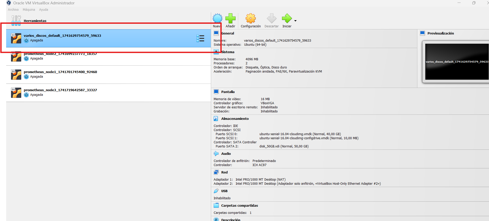
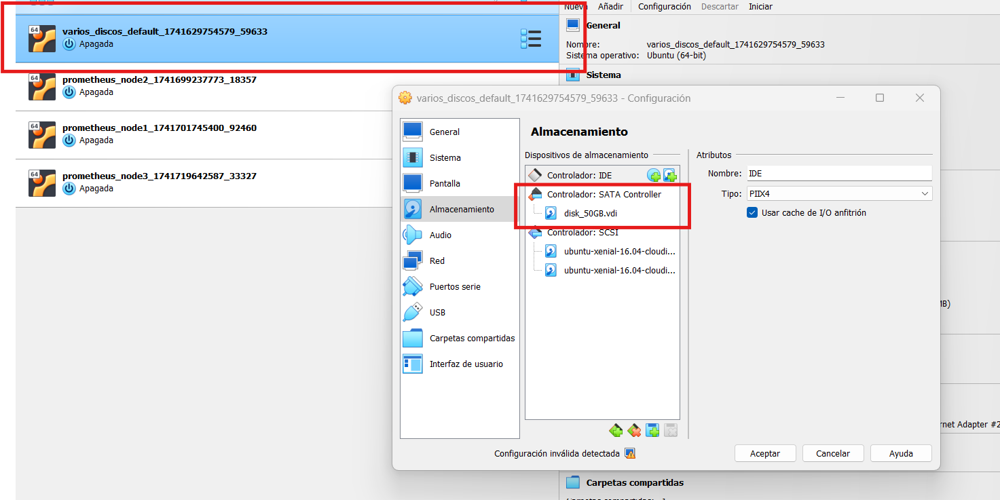
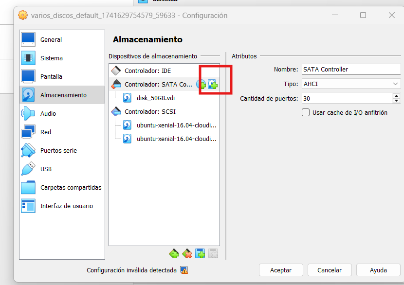
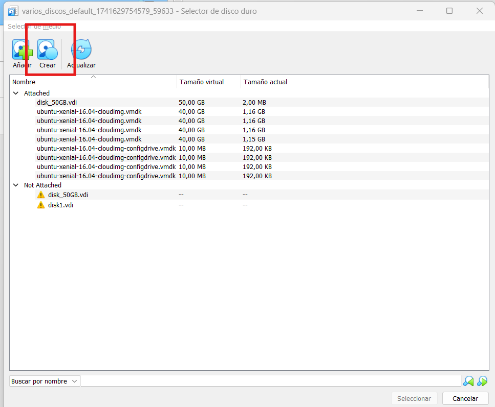
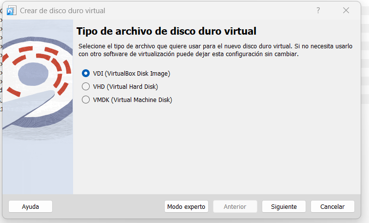
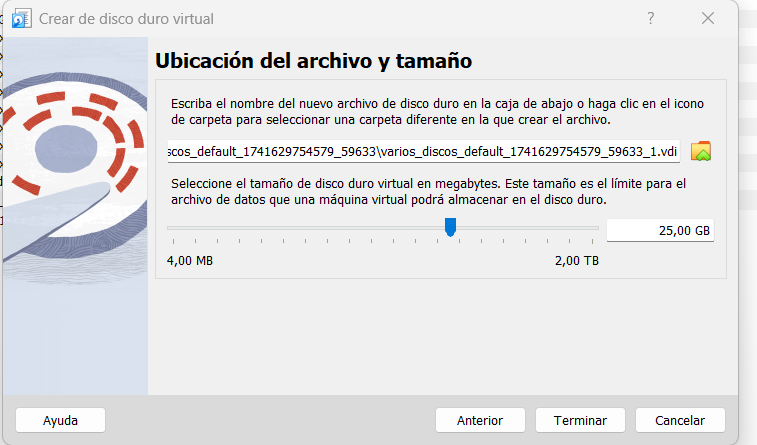
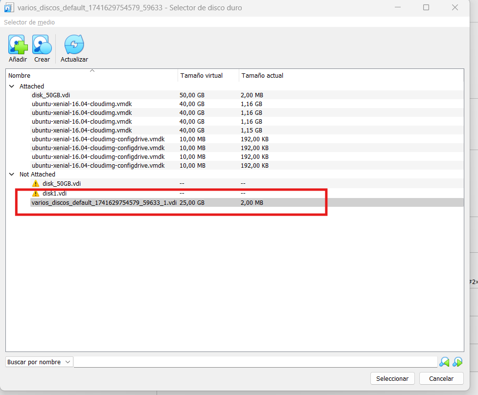
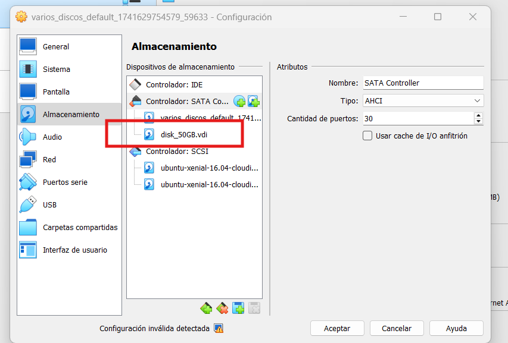

Añadir un disco duro a una máquina virtual.

- Crear una máquina virtual con vagrant con acceso por ssh tal y como hemos visto
- Añadir un disco duro de 30gb
- El disco duro se tiene que guardar con el nombre de vuestro nia
- Visualizar desde ubuntu como acceder a ese disco duro (montar)
- Estudiar las particiones, o sistema de ficheros que tiene (comando que lo muestre)
- Probad a montarlo en varios directorios dentro de mnt (varios nombres)

Problemas que tenéis que resolver.

- Añadir el disco
- Montar el disco (entender el concepto de montar)
- visualizar el sistema de ficheros y contenido que tiene

A Continuación tenéis una guía de como añadir un disco duro a virtualbox.

