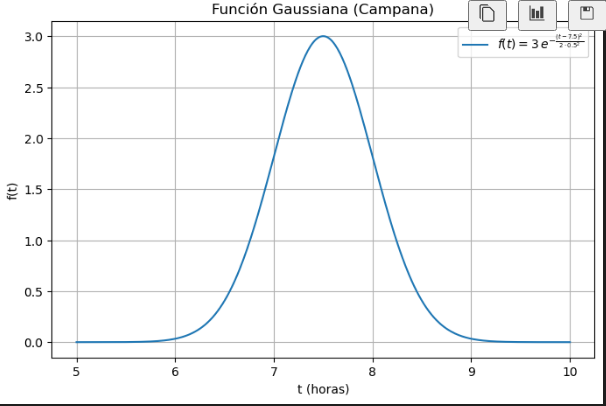

La **distribución normal** o **gaussiana** se define matemáticamente mediante la función de densidad de probabilidad (PDF):

\[
\phi(x) = \frac{1}{\sqrt{2\pi\,\sigma^2}}\, \exp\left(-\frac{(x-\mu)^2}{2\sigma^2}\right)
\]

Donde:
- \(\mu\) es la media (el centro de la distribución).
- \(\sigma\) es la desviación estándar (que indica la dispersión o "ancho" de la campana).
- \(2\sigma^2\) aparece en el denominador del exponente como resultado del proceso de normalización y de las propiedades de la varianza de la distribución.


### ¿De Dónde Viene el Factor \(2\sigma^2\)?

1. **Varianza y la Exponencial:**

   En la distribución normal, la varianza es \(\sigma^2\). Cuando se formula la función de densidad, se usa el término \(\frac{(x-\mu)^2}{2\sigma^2}\) en el exponente. ¿Por qué el 2?  
   
   La razón es que, para garantizar que el área bajo la curva sea 1 (condición indispensable de cualquier función de densidad de probabilidad), el exponente debe tener esa forma. Matemáticamente, la integral de \(\exp\left(-\frac{(x-\mu)^2}{2\sigma^2}\right)\) sobre toda la recta real, cuando se incluye el factor de normalización \(\frac{1}{\sqrt{2\pi\,\sigma^2}}\), da exactamente 1.  
   
   Este \(2\sigma^2\) proviene de la solución de la integral gaussiana y es crucial para el correcto escalado de la campana de Gauss.

2. **Pasando de la PDF a una Función de Pico para Simulación:**

   En muchos casos, como el de simular picos de consumo (por ejemplo, de agua), no necesitamos una función de densidad de probabilidad en el sentido estricto (es decir, no es necesario que el área total bajo la curva sea 1).  
   
   Queremos una función con forma de campana que tenga una **amplitud** ajustable. Para ello, introducimos un parámetro \(A\) que actúa como factor multiplicativo. Así, en lugar de usar la PDF completa, usamos:
   
   \[
   f(t) = A\, \exp\left(-\frac{(t-\mu)^2}{2\sigma^2}\right)
   \]
   
   Aquí:
   - \(A\) representa la **amplitud** o el valor máximo que alcanza la función (en nuestro ejemplo, relacionado con la cantidad de agua consumida).
   - La forma \(\exp\left(-\frac{(t-\mu)^2}{2\sigma^2}\right)\) mantiene la "campana" característica, centrada en \(\mu\) y con dispersión controlada por \(\sigma\).


### Resumen del Proceso

1. **Inicio con la Distribución Normal:**

   Tenemos la PDF:
   
   \[
   \phi(x) = \frac{1}{\sqrt{2\pi\,\sigma^2}}\, \exp\left(-\frac{(x-\mu)^2}{2\sigma^2}\right)
   \]

2. **Eliminar la Constante de Normalización:**

   Para usar la función como un **modelo de pico** (y no como una distribución de probabilidad), podemos ignorar la constante \(\frac{1}{\sqrt{2\pi\,\sigma^2}}\) y simplemente trabajar con la parte exponencial:
   
   \[
   f(x) \propto \exp\left(-\frac{(x-\mu)^2}{2\sigma^2}\right)
   \]

3. **Introducir la Amplitud \(A\):**

   Multiplicamos por \(A\) para poder ajustar la altura del pico:
   
   \[
   f(t) = A\, \exp\left(-\frac{(t-\mu)^2}{2\sigma^2}\right)
   \]
   
   Así, \(A\) controla el **valor máximo** de \(f(t)\) en \(t = \mu\) (recordando que \(\exp(0)=1\)).


### Ejemplo Numérico

Supongamos que queremos simular el pico de consumo de agua durante la mañana. Podemos fijar:
- \(\mu = 7.5\) (7:30 AM, el centro del pico).
- \(\sigma = 0.5\) (lo que indica que la mayoría del consumo se concentra en una ventana de aproximadamente 1 hora).
- \(A = 3.0\) (esto sería el pico máximo de consumo, por ejemplo, 3 litros/minuto).

La función queda:

\[
f(t) = 3.0\, \exp\left(-\frac{(t-7.5)^2}{2(0.5)^2}\right) = 3.0\, \exp\left(-\frac{(t-7.5)^2}{0.5}\right)
\]

Esta función tendrá su valor máximo de 3.0 en \(t=7.5\) y decrecerá simétricamente a medida que \(t\) se aleje de 7.5.


A continuación te muestro un ejemplo en Python que genera la gráfica de la función:

\[
f(t) = A\, \exp\left(-\frac{(t-\mu)^2}{2\sigma^2}\right)
\]

Usaremos los siguientes parámetros:
- \(A = 3.0\)
- \(\mu = 7.5\) (por ejemplo, 7:30 AM)
- \(\sigma = 0.5\)

El código es el siguiente:

```python
import numpy as np
import matplotlib.pyplot as plt

# Parámetros
A = 3.0
mu = 7.5
sigma = 0.5

# Crear un vector de tiempos (por ejemplo, de 5 a 10 horas)
t = np.linspace(5, 10, 400)

# Calcular f(t)
f = A * np.exp(-((t - mu)**2) / (2 * sigma**2))

# Graficar
plt.figure(figsize=(8, 5))
plt.plot(t, f, label=r'$f(t) = 3\,e^{-\frac{(t-7.5)^2}{2\cdot 0.5^2}}$')
plt.xlabel('t (horas)')
plt.ylabel('f(t)')
plt.title('Función Gaussiana (Campana)')
plt.legend()
plt.grid(True)
plt.show()
```

La gráfica resultante es la siguiente:



Como puedes ver, la función tiene la forma característica de una campana, centrada en \(t = 7.5\) y con una anchura determinada por \(\sigma = 0.5\). Esto demuestra cómo la función \(f(t)\) modela un pico o "campana". 

Para abordar la simulación de un sensor que genere datos de consumo de agua en una vivienda, es fundamental comprender y modelar el comportamiento real de uso en función de distintos factores: la distribución horaria de las actividades, el número de habitantes y las variaciones estacionales (entre otros posibles factores). A continuación, te explico detalladamente cómo puedes plantear el problema, modelarlo y generar datos artificiales en Python, acompañando la explicación de ejemplos y código.


## 1. Comprendiendo el Comportamiento Real del Consumo

### a. Distribución Horaria del Uso

La idea es que en una casa el consumo de agua no es uniforme a lo largo del día. Por ejemplo:

- **Mañana (alrededor de las 7:00 a 9:00):**  
  Al despertar, se realizan actividades como ducharse, lavarse la cara, y usar el inodoro.  
  **Ejemplo:**  
  - Duchas: 15-20 litros por persona.
  - Lavado en inodoro: 6-9 litros por descarga.
  - Pequeños usos (café, lavado de manos, etc.).

- **Mediodía (alrededor de las 13:00 a 15:00):**  
  Se pueden producir picos por actividades relacionadas con la preparación de alimentos o incluso uso de lavavajillas y lavadoras.  
  **Ejemplo:**  
  - Uso de electrodomésticos que consumen más agua.

- **Noche (alrededor de las 20:00 a 22:00):**  
  Regreso a casa y realización de actividades similares a la mañana.  
  **Ejemplo:**  
  - Uso intensivo de inodoros, duchas y, posiblemente, uso de lavavajillas.

Además, entre estos picos hay un **consumo basal** (por ejemplo, uso mínimo para mantener la presión en la red, fugas o consumos menores).

### b. Factores Adicionales

- **Número de Habitantes:**  
  Más personas implican un aumento en el número de eventos (duchas, descargas, etc.). Se puede modelar como un factor multiplicativo o como eventos independientes.

- **Estacionalidad:**  
  En verano, por ejemplo, podría haber una disminución en el uso de agua para duchas (o un cambio en la rutina) o en invierno un aumento si se usan más calefacciones con sistemas de vapor o se incrementa el consumo en otras actividades.  
  Puedes introducir un factor de corrección estacional.


## 2. Modelando el Consumo con Funciones Matemáticas

Una estrategia común es modelar cada pico de consumo con una **función gaussiana (normal)**, que tiene la forma:

\[
f(t) = A \cdot \exp\left(-\frac{(t - \mu)^2}{2\sigma^2}\right)
\]

donde:
- \(A\) es la amplitud del pico (cantidad de agua consumida en ese evento).
- \(\mu\) es la hora central del pico (por ejemplo, 7:30 para el pico matutino).
- \(\sigma\) controla la dispersión en el tiempo (cuánto se extiende el pico).

Para simular el consumo diario, puedes definir varias de estas funciones y sumarlas. Por ejemplo:

- **Pico Matutino:**  
  \(A_1\), \(\mu_1 \approx 7.5\) horas, \(\sigma_1\) (tal vez 0.5 horas).

- **Pico Mediodía:**  
  \(A_2\), \(\mu_2 \approx 14\) horas, \(\sigma_2\).

- **Pico Nocturno:**  
  \(A_3\), \(\mu_3 \approx 21\) horas, \(\sigma_3\).

Y además, puedes añadir un término constante \(B\) para el consumo basal.

La función total del consumo \(C(t)\) en un instante \(t\) sería:

\[
C(t) = B + \sum_{i=1}^{N} A_i \cdot \exp\left(-\frac{(t - \mu_i)^2}{2\sigma_i^2}\right) + \epsilon(t)
\]

donde \(\epsilon(t)\) es un término de ruido (por ejemplo, ruido gaussiano) para simular la variabilidad real.

### c. Ajustes según el Número de Habitantes y Estacionalidad

- **Habitantes:**  
  Si \(n\) es el número de personas, puedes hacer que cada \(A_i\) dependa de \(n\) (por ejemplo, \(A_i = n \cdot A_{i,base}\)).

- **Estacionalidad:**  
  Introduce un factor \(S(t_{estacion})\) que modifique la amplitud o incluso el comportamiento de los picos. Por ejemplo, en invierno \(A_i\) podría aumentar un 10% en ciertos picos.


## 3. Implementación en Python

A continuación, se muestra un ejemplo de código que simula el consumo de agua durante un día. Se utiliza NumPy para el cálculo y Matplotlib para visualizar los resultados.

```python
import numpy as np
import matplotlib.pyplot as plt

# Definición de parámetros
# Tiempo en horas
t = np.linspace(0, 24, 1440)  # simulamos en minutos (1440 puntos)

# Consumo basal (litros/minuto)
B = 0.05  

# Parámetros para los picos:
# Pico matutino
A1 = 1.0     # Amplitud base (litros/minuto)
mu1 = 7.5    # Hora central
sigma1 = 0.5 

# Pico mediodía
A2 = 0.8
mu2 = 14.0
sigma2 = 0.7

# Pico nocturno
A3 = 1.2
mu3 = 21.0
sigma3 = 0.6

# Número de habitantes (factor multiplicativo)
n_habitantes = 3
A1 *= n_habitantes
A2 *= n_habitantes
A3 *= n_habitantes

# Funciones gaussianas para cada pico
def gaussian(t, A, mu, sigma):
    return A * np.exp(-((t - mu)**2) / (2 * sigma**2))

consumo_matutino = gaussian(t, A1, mu1, sigma1)
consumo_mediodia = gaussian(t, A2, mu2, sigma2)
consumo_nocturno = gaussian(t, A3, mu3, sigma3)

# Consumo total sin ruido
consumo_total = B + consumo_matutino + consumo_mediodia + consumo_nocturno

# Añadiendo ruido aleatorio (por ejemplo, ruido gaussiano con media 0)
ruido = np.random.normal(0, 0.05, size=t.shape)
consumo_total_con_ruido = consumo_total + ruido

# Visualización
plt.figure(figsize=(12, 6))
plt.plot(t, consumo_total_con_ruido, label='Consumo simulado (con ruido)', color='blue')
plt.plot(t, consumo_total, label='Consumo base (sin ruido)', color='red', linestyle='--')
plt.xlabel('Hora del día')
plt.ylabel('Consumo de agua (litros/minuto)')
plt.title('Simulación del consumo de agua en una vivienda')
plt.legend()
plt.grid(True)
plt.show()
```

### Explicación del Código

- **Línea de Tiempo:**  
  Se genera un vector `t` que representa cada minuto del día (0 a 24 horas).

- **Consumo Basal:**  
  Se define una pequeña cantidad constante `B` que simula un consumo mínimo continuo.

- **Picos Gaussianos:**  
  Se definen tres picos (matutino, mediodía y nocturno) usando la función `gaussian`. Las amplitudes se ajustan multiplicándolas por el número de habitantes.

- **Ruido:**  
  Se añade un ruido gaussiano para simular la variabilidad real en el consumo.

- **Visualización:**  
  Se grafica el consumo base sin ruido y el consumo con ruido para ver cómo se distribuyen a lo largo del día.

### La gráfica completa es:


## 4. Consideraciones y Posibles Mejoras

- **Validación con Datos Reales:**  
  Si tienes acceso a datos reales (o estudios de consumo) podrías ajustar los parámetros (\(A\), \(\mu\), \(\sigma\)) para que el simulador se aproxime mejor a la realidad.

- **Eventos Discretos vs. Continuos:**  
  Otra aproximación es modelar cada evento (por ejemplo, cada ducha o descarga) de forma discreta y luego sumar dichos eventos en función del tiempo. Esto se puede hacer generando eventos aleatorios según una distribución de Poisson, por ejemplo.

- **Estacionalidad y Factores Adicionales:**  
  Se podría introducir una función periódica anual (por ejemplo, una función seno) que modifique los parámetros de consumo para representar la variación estacional.

- **Uso de Modelos de Machine Learning:**  
  En una asignatura de Big Data podrías plantear la generación de datos simulados y, posteriormente, aplicar técnicas de clustering o series temporales para identificar patrones en el consumo.


